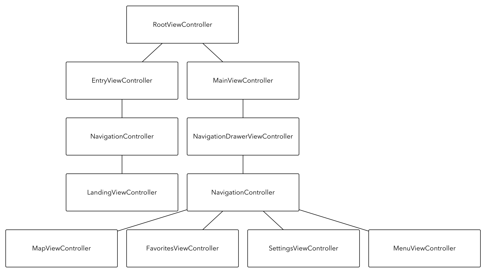

BDModules
=====

What are BDModules?
--------------
BDModules are a collection of Swift modules designed to aid in architecting a RESTful iOS client app.  The `Harness` workspace is provided to give working examples of most of the modules.

## Requirements

- iOS 8.3+ / Mac OS X 10.10+
- Xcode 6.3
- Cocoapods 0.36.0

## Cocoapods Installation

1. Add BDModules as a line in your Podfile `pod 'BDModules', :git => 'https://github.com/banDedo/BDModules.git'`
2. Run `pod install`
3. Add `import BDModules` to the file(s) that you wish the use it in.

# Harness View Controller Hierarchy



# Dependency Injection

The **BDModules** Harness application uses top level **`Factories`** to assemble elements and as an ad hoc dependency injection mechanism.  

## Scope

### Prototypes
Public methods return object prototypes that are newly instantiated with each call.

### Singleton
Public lazy instance variables are retained over the lifetime of the factory and serve as a means of retaining and injecting singleton instances throughout the application.

## Injectable Elements

Injectable elements are defined using the `lazy` keyword.  Read the **Use Lazy Variables Section** of [this article](http://nshipster.com/new-years-2015/ "NSHipster Reader Submissions -
New Year's 2015") for reasoning behind this.

## Factories

The Harness application is composed of the following **`Factory`** instances:

- **`ApplicationFactory`** - Injects root view controller into application and constructs/wires up all other factories.
- **`EntryFactory`** - Injection mechanism for VC's contained in login flow.
- **`MainFactory`** - Injection mechanism for VC's contained in logged-in flow.
- **`APIFactory`** - Constructs core API services for application
- **`ModelFactory`** - Builds model objects from API JSON objects.
- **`JSONFactory`** - Provides JSON serializer for general application use.

### ApplicationFactory

The `ApplicationFactory` is created as a member variable of the `AppDelegate` and performs the initial injection on application launch.

```swift
public class AppDelegate: UIResponder, UIApplicationDelegate {

    // MARK:- Injectable
    
    lazy public var appLifecycleLogger = Logger()
    lazy public var rootViewController: RootViewController = RootViewController()
	
    // MARK:- Properties

    public let applicationFactory = ApplicationFactory()
    public var window: UIWindow? = UIWindow(frame: UIScreen.mainScreen().bounds)

    // MARK:- Application Lifecycle

    public func application(application: UIApplication, didFinishLaunchingWithOptions launchOptions: [NSObject: AnyObject]?) -> Bool {
        // Inject logger and rootViewController injectable elements
        applicationFactory.inject(self)
        
        /** Set injected root view controller as root of the
            application's main window **/
        window?.rootViewController = rootViewController
        window?.makeKeyAndVisible()
		 
        appLifecycleLogger.logVerbose("Application did finish launching")

        return true
    }

    ...
    
}
```
The `ApplicationFactory` first creates all the other factories for the application and wires up depenedent pieces in the `init()` method.  The `inject(appDelegate: AppDelegate)` method must be called explicitly by the `AppDelegate` instance on app load.  Here the factories of the application are strongly coupled.  They can be decoupled by defining interfaces for the components they provide.

```swift
public class ApplicationFactory {
    
    // MARK:- Factories
    
    public let apiFactory = APIFactory()
    public let entryFactory = EntryFactory()
    public let jsonFactory = JSONFactory()
    public let mainFactory = MainFactory()
    public let modelFactory = ModelFactory()

    // MARK:- RootViewController

    public func rootViewController() -> RootViewController {
        let rootViewController = RootViewController()
        rootViewController.accountUserProvider = apiFactory.accountUserProvider
        rootViewController.entryFactory = entryFactory
        rootViewController.mainFactory = mainFactory
        return rootViewController
    }

    // MARK:- Constructor

    public init() {

        // ModelFactory
        
        modelFactory.jsonSerializer = jsonFactory.jsonSerializer
        modelFactory.logError = log(modelLogger, .Error)
        modelFactory.objectMapperPair = ModelFactoryMapper.objectMapperPair(modelFactory)

        // APIFactory
        
        apiFactory.jsonSerializer = jsonFactory.jsonSerializer
        apiFactory.modelFactory = modelFactory

        // JSONFactory
        
        jsonFactory.apiFactory = apiFactory

        // EntryFactory
        
        entryFactory.apiFactory = apiFactory
        
        // MainFactory
        
        mainFactory.apiFactory = apiFactory
        mainFactory.applicationFactory = self
        mainFactory.jsonFactory = jsonFactory

    }
    
    // MARK:- Initial injection

    public func inject(appDelegate: AppDelegate) {
        appDelegate.appLifecycleLogger = logger
        appDelegate.rootViewController = rootViewController()
    }

    // MARK:- Application
    
    public lazy var logger: Logger = {
        let logger = Logger(tag: "Application Lifecycle", applicationName: "BDModules")
        let loggerSettings = self.apiFactory.userDefaults.loggerSettings
        logger.enabled = loggerSettings.isLoggerEnabled(logger)
        logger.thresholdLevel = loggerSettings.loggerLevel(logger)
        logger.synchronous = true
        return logger
        }()

    // MARK:- ModelFactory

    public lazy var modelLogger: Logger = {
        let logger = Logger(tag: "Model", applicationName: "BDModules")
        let loggerSettings = self.apiFactory.userDefaults.loggerSettings
        logger.enabled = loggerSettings.isLoggerEnabled(logger)
        logger.thresholdLevel = loggerSettings.loggerLevel(logger)
        logger.synchronous = true
        return logger
        }()

}
```

### APIFactory

The `APIFactory` handles injections of objects mediating the app/API interaction.

#### APISessionManager

The `APIFactory` spins up `APISessionManager` instances to manage API HTTP sessions.  All API HTTP requests go through a single `APISessionManager` instance method.

#### OAuth2SessionManager/OAuth2Authorization

The `OAuth2SessionManager` has **Prototype** scope and is responsible for token grant/token refresh calls.

The `OAuth2Authorization` instance also has **Singleton** scope and is responsible for enqueuing/retrying unauthorized requests through the `OAuth2SessionManager`.

#### AccountUserProvider

The `AccountUserProvider` class holds the logged in `User` and the associated `OAuth2Credential`.

#### UserAPI

An `UserAPI` instance is generated to aid in login.  The `me()` request asynchronously returns a `User` object.

#### LocationRepository

A `LocationRepository` instance is generated to retrieve a collection of a `User`'s favorite locations.

### ModelFactory

The `ModelFactory` is responsible for transforming an `APIServiceClient` JSON response object into a first class `ModelObject`.  It transforms `Repository` JSON collection responses into a `ModelObject` collection.

# Networking

The **Networking** module provides the following out of the box:

- An `APISessionManager` that can be used to wraps all RESTful calls.  A session manager has the ability to log requests and responses with injection of a logging closure.
- `OAuth2SessionManager/OAuth2Authorization` that manage an `OAuth2Credential` and handles token grant/refresh calls
- A generic `APIServiceClient` class which handles API requests and map response objects onto native `ModelObject` instances
- A generic `Repository` class which handles API collection requests and manage state of fetched/fetching collection.

## APISessionManager

The primary method of the `APISessionManager` is shown below:

```swift
public func performRequest(
   #method: Method,
   path: String,
   authorizationHeader: String?,
   parameters: NSDictionary?,
   files: [ MultipartFile ]? = nil,
   handler: URLSessionDataTaskHandler) -> NSURLSessionDataTask! {
   
   ...
   
}
```

Where `Method` enumerates all of the HTTP verbs,

```swift
// MARK:- Enumerated Types

public enum Method: String {
   case HEAD = "HEAD"
   case GET = "GET"
   case PUT = "PUT"
   case POST = "POST"
   case PATCH = "PATCH"
   case DELETE = "DELETE"
}

```

`MultipartFile` is a `Protocol` that wraps objects that are sent in multipart uploads,

```swift
@objc public protocol MultipartFile {
   
    var data: NSData { get }
    var name: String { get }
    var fileName: String { get }
    var mimeType: String { get }
    
}

extension UIImage: MultipartFile {
    
    public var data: NSData {
        return UIImagePNGRepresentation(self)
    }
    
    public var name: String {
        return "image"
    }

    public var fileName: String {
        return "image.png"
    }
  
    public var mimeType: String {
        return "image/png"
    }
    
}
```

and `URLSessionDataTaskHandler` is a block type that asynchronously passes request/response parameters back on completion of the request.

```swift
public typealias URLSessionDataTaskHandler = (NSURLSessionDataTask!, NSDictionary?, NSError?) -> Void
```

The `dynamicBaseURL` and `authorizationHeader` properties are dynamic.  The authorization header is set on each request.  The dynamic base URL can change on redirect.  In the `APIFactory` class we see that on redirect, the base URL for the session manager and global factory base URL are swapped out when a redirect is received.

```swift
// MARK:- Session Manager
    
public func sessionManager() -> APISessionManager {
   let sessionManager = APISessionManager(dynamicBaseURL: baseURL)
   
   sessionManager.jsonSerializer = jsonSerializer
   sessionManager.logWarning = log(logger, .Warning)
   sessionManager.logInfo = log(logger, .Info)
   
   sessionManager.setTaskWillPerformHTTPRedirectionBlock { URLSession, URLSessionTask, response, request -> NSURLRequest! in
       if let baseURLString: String = (response as? NSHTTPURLResponse)?.allHeaderFields["Location"] as? String where count(baseURLString) > 0 {
           self.baseURL = NSURL(string: baseURLString)!
           sessionManager.dynamicBaseURL = self.baseURL
       }
       
       return request
   }
   
   return sessionManager
}
```

## OAuth2Credential

An `OAuth2Credential` stores an OAuth2 `accessToken` and `refreshToken`.

## OAuth2SessionManager

Derived from `APISessionManager`, an `OAuth2SessionManager` is responsible for granting and refreshing a `OAuth2Credential` for the current session.

## OAuth2Authorization

The **Singleton** `OAuth2Authorization` is responsible for refreshing an expired `OAuth2Credential` when one or more `APISessionManager` requests respond with a 401.  When an `Unauthorized` status code is returned the current request is enqueued and a refresh token call is made to the **Singleton** `Oauth2SessionManager` instance.  Upon successful refresh the enqueued requests are refired with the updated `OAuth2Credential` and the caller is unaware of the initial `Unauthorized` response.  See `APIServiceClient` and `Repository` for an example of it's use.

## Model

Before proceeding with other pieces of the **Networking** stack we pause to discuss fundamentals of the models that are considered.

In one light there are two fundamental types of objects that can be retrieved from an API request.

* **Value objects** - An object with `type` but no identity. 
* **Model objects** - An object also containing a `type` and possessing an `identity`.  Identity is determined by `uuid`.

### ValueObject

```swift
public class ValueObject: NSObject, NSCoding, Equatable {

    // MARK:- Injectable

    lazy public var jsonSerializer = JSONSerializer()

    // MARK:- Properties
    
    private(set) public var dictionary: NSDictionary
    private(set) public var type: String = ""

    public init(dictionary: NSDictionary) {
        self.dictionary = dictionary.mutableCopy() as! NSMutableDictionary
        super.init()
    }

    public override init() {
        fatalError("init() not implemented.")
    }

    // MARK:- NSCoding
    
    required public init(coder aDecoder: NSCoder) {
        dictionary = aDecoder.decodeObjectForKey(kValueObjectDictionaryKey) as! NSMutableDictionary
        super.init()
    }
    
    public func encodeWithCoder(aCoder: NSCoder) {
        aCoder.encodeObject(dictionary, forKey: kValueObjectDictionaryKey)
    }

    // MARK:- Logging
    
    override public var description: String {
        get {
            return jsonSerializer.string(object: self.dictionary) ?? ""
        }
    }
    
}

// MARK:- Equatable

public func ==(lhs: ValueObject, rhs: ValueObject) -> Bool {
    return lhs.dictionary.isEqualToDictionary(rhs.dictionary as [ NSObject: AnyObject ])
}

```

### ModelObject

```swift
public class ModelObject: ValueObject, Hashable {
   
    // MARK:- Properties
        
    private(set) public var uuid: String = ""
    
    // MARK:- Hashable

    override public var hashValue: Int {
        return type.hashValue ^ uuid.hashValue
    }

    override public var hash: Int {
        return hashValue
    }

    override public func isEqual(object: AnyObject?) -> Bool {
        if object != nil && object!.isKindOfClass(self.dynamicType) {
            let model = object as! ModelObject
            return self.type == model.type && self.uuid == model.uuid
        } else {
            return false
        }
    }

}

// MARK:- Equatable

public func ==(lhs: ModelObject, rhs: ModelObject) -> Bool {
    return lhs.type == rhs.type && lhs.uuid == rhs.uuid
}
```

Both `ValueObject` and `ModelObject` instances are derived from JSON responses returned from API requests.  Below we see that every `ValueObject` and `ModelObject` instance has a corresponding `APIMapper` that is responsible for mapping JSON values onto native fields.

```swift
private let kUserFirstNameKey = "firstName"
private let kUserLastNameKey = "lastName"
private let kUserEmailKey = "email"
private let kUserPhoneNumberKey = "phoneNumber"
private let kUserCoverImageURLKey = "coverImageURL"
private let kUserProfileImageURLKey = "profileImageURL"

public class User: ModelObject, UserProfile {
   
    // MARK:- Properties
    
    private(set) public var firstName = ""
    private(set) public var lastName = ""
    private(set) public var email = ""
    private(set) public var phoneNumber: String?
    private(set) public var coverImageURL: String?
    private(set) public var profileImageURL: String?
    
    public var displayName: String {
        get {
            return firstName + " " + lastName
        }
    }

}

public let kUserFirstNameApiKeyPath = "first_name"
public let kUserLastNameApiKeyPath = "last_name"
public let kUserEmailApiKeyPath = "email"
public let kUserPhoneNumberApiKeyPath = "phone_number"
public let kUserCoverImageURLApiKeyPath = "cover_image_url"
public let kUserProfileImageURLApiKeyPath = "profile_image_url"

public class UserAPIMapper: ModelObjectAPIMapper {
    
    // MARK:- Constructor
    
    public override init(apiFieldMappers: [ APIFieldMapper] = [APIFieldMapper ](), delegate: APIMapperDelegate) {
        super.init(apiFieldMappers: apiFieldMappers, delegate: delegate)
        var apiFieldMappers = super.apiFieldMappers
        apiFieldMappers += [
            delegate.fieldMapper(apiKeyPath: kUserFirstNameApiKeyPath, modelKey: kUserFirstNameKey),
            delegate.fieldMapper(apiKeyPath: kUserLastNameApiKeyPath, modelKey: kUserLastNameKey),
            delegate.fieldMapper(apiKeyPath: kUserEmailApiKeyPath, modelKey: kUserEmailKey),
            delegate.fieldMapper(apiKeyPath: kUserPhoneNumberApiKeyPath, modelKey: kUserPhoneNumberKey, required: false),
            delegate.fieldMapper(apiKeyPath: kUserCoverImageURLApiKeyPath, modelKey: kUserCoverImageURLKey, required: false),
            delegate.fieldMapper(apiKeyPath: kUserProfileImageURLApiKeyPath, modelKey: kUserProfileImageURLKey, required: false),
        ]
        self.apiFieldMappers = apiFieldMappers
    }
    
}
```
The `APIFieldMapper` class can also parse value/model objects, as well as arrays of value/model objects by specifying the `FieldType` parameters.

```
public class APIFieldMapper: NSObject {
    
    public enum FieldType {
        case Default
        case ValueObject
        case ValueArray
    }
    
    private let apiKeyPath: String
    private let modelKey: String
    private let required: Bool
    private let type: FieldType
    
    public init(
        APIKeyPath: String,
        modelKey: String,
        required: Bool,
        type: FieldType) {
            self.apiKeyPath = apiKeyPath
            self.modelKey = modelKey
            self.required = required
            self.type = type
            super.init()
    }
    
}
```

## APIServiceClient

`APIServiceClient` is a generic class that is performs API requests that return parsed `ValueObject` instances.

```swift
public func performRequest(
    #method: APISessionManager.Method,
    path: String,
    parameters: NSDictionary? = nil,
    files: [ MultipartFile ]? = nil,
    handler: (T?, NSError?) -> Void) {
    
    ...
    
}
```

An example of it's use can be seen in the `UserAPI` class:

```swift
public class UserAPI {
    
    // MARK:- Injectable
    
    public lazy var accountUserProvider = AccountUserProvider()
    public lazy var oAuth2SessionManager = OAuth2SessionManager()
    public lazy var userServiceClient = APIServiceClient<User>()
    
    public func login(
        #email: String,
        password: String,
        userPersistenceHandler: User -> Void,
        handler: ((User?, NSError?) -> Void)) {
            oAuth2SessionManager.tokenGrant(
                username: email,
                password: password) { [weak self] URLSessionDataTask, responseObject, error in
                    if let strongSelf = self {
                        if error != nil {
                            handler(nil, error)
                        } else {
                            strongSelf.me(userPersistenceHandler, handler: handler)
                        }
                    }
            }
    }
    
    public func me(
        userPersistenceHandler: User -> Void,
        handler: ((User?, NSError?) -> Void)) {
            userServiceClient.performRequest(
                method: .GET,
                path: APIResource.Users.path().stringByAppendingPathComponent("/me")) { [weak self] user, error in
                    if let strongSelf = self {
                        if error != nil {
                            handler(nil, error)
                        } else {
                            userPersistenceHandler(user!)
                            handler(user, nil)
                        }
                    }
            }
    }
    
}
```
The `userPersistenceHandler()` closure is created in the `AccountUserProvider` class and handles in-memory and keychain persistence of the account user.

```swift
// MARK:- Persistence

    public func userPersistenceHandler() -> (User -> Void) {
        return { user in
            self.accountUser.user = user
            self.keychain.setObject(self.accountUser, forKey: kAccountUserProviderKey)
        }
    }
```

### ModelFactory

At the core of the `APIServiceClient` parsing lies an `objectParser` closure that is injected from the `ModelFactory`.

```swift
performRequest(
   method: method,
   path: path,
   parameters: parameters,
   files: files) { [weak self] urlSessionDataTask, responseObject, error in
       if let strongSelf = self {
           let completionHandler: URLSessionDataTaskHandler = { [weak self] urlSessionDataTask, responseObject, error in
               if let strongSelf = self {
                   if error == nil {
                       let object = strongSelf.objectParser(responseObject!) as! T
                       handler(object, nil)
                   } else {
                       handler(nil, error)
                   }
               }
           }
           
           ...
           
       }
       
       ...
           
}
```
If we look back to our request to the `me()` endpoint previously, we consider the functionality of the object parser.  A sample response is given below:

```
{
    "data": {
        "id": "b3476de8-be3c-11e4-a0c5-3b35f9015881",
        "cover_image_url": "http://test.com/users/cover.png",
        "phone_number": null,
        "created_at": 1425012864,
        "type": "user",
        "profile_image_url": "http://test.com/users/profile.png",
        "address": null,
        "first_name": "John",
        "updated_at": 1425012864,
        "username": null,
        "last_name": "Smith",
        "email": "abc@cba.com",
        "user_status": "Active"
    },
    "code": "OK"
}
```

The default object parser is defined in the the `ModelFactory` class,

```swift
public var defaultObjectParser: (NSDictionary -> ValueObject) {
    return { dictionary in
        return self.object(dictionary["data"] as! NSDictionary)
    }
}
```

We see it simply digs into the `data` field and extracts the contained dictionary.  This calls the factory `object(dictionary: NSDictionary)` method which maps the JSON object onto a newly created `ValueObject` or `ModelObject`


## Repository

`Repository` is a generic class that is used to retrieve `ModelObject` collections.  The `Repository` also manages state of fetch requests and holds the results of paging requests.

```swift
// MARK:- Enumerated Types

public enum FetchState: String {
    case NotFetched = "NotFetched"
    case Fetching = "Fetching"
    case Fetched = "Fetched"
    case Error = "Error"
}  
```

It will not perform an additional fetch or paging request while a request is already in flight.

We see an example of its use in `MapViewController` class:

```swift
// MARK:- View lifecycle
    
public override func viewDidLoad() {
    super.viewDidLoad()
    
    title = "On Trip"
    
    view.addSubview(mapView)
            
    mapView.snp_makeConstraints { make in
        make.edges.equalTo(UIEdgeInsetsZero)
    }
    
    if let location = userDefaults.lastUserLocation {
        zoomToCoordinate(
            CLLocationCoordinate2DMake(
                location[kUserDefaultsLastUserLocationLatitudeKey] as! CLLocationDegrees,
                location[kUserDefaultsLastUserLocationLongitudeKey] as! CLLocationDegrees
            ),
            animated: false
        )
    }
    
    locationRepository.fetch() { [weak self] locations, error in
        if let strongSelf = self {
            if error != nil {
                let alertController = UIAlertController(
                    title: "Error",
                    message: error!.description,
                    preferredStyle: UIAlertControllerStyle.Alert
                )
                
                alertController.addAction(
                    UIAlertAction(
                        title: "OK",
                        style: UIAlertActionStyle.Cancel) { action in
                             strongSelf.dismissViewControllerAnimated(true, completion: nil)
                    }
                )
                
                strongSelf.presentViewController(alertController, animated: true, completion: nil)
            }
            strongSelf.updateUI()
        }
    }
   
}
```
On successful completion of the fetch request, we switch off of the state of the repository and iterate through its parsed `ModelObject` elements to update the UI.

```swift
// MARK:- UI Update
    
public func updateUI() {
    switch locationRepository.fetchState {
    case .NotFetched:
        break
    case .Fetching:
        break
    case .Fetched:
        for location in locationRepository.elements {
            let annotation = MKPointAnnotation()
            annotation.coordinate = CLLocationCoordinate2DMake(location.latitude, location.longitude)
            annotation.title = location.title
            annotation.subtitle = location.subtitle
            mapView.addAnnotation(annotation)
        }
        break
    case .Error:
        break
    }
}
```

# API Convention

## Naming:

* **Field names**: snake_case
* **Constants (string enums)**: CamelCase

## Object ID's:

Each object should be assigned a time-sortable uuid.

e.g. - `3a91f950-dec8-4688-ba14-5b7bbfc7a563`

## Type:

All value objects should be returned with `type` parameter to make for simpler parsing using factories on client side.  All models should include `type` and `id` fields.

## Response format:

The top level of every API response will contain a “code” key.  In the case of success, the corresponding value should be “OK”.

```
{
    "data": {
        "id": "b3476de8-be3c-11e4-a0c5-3b35f9015881",
        "cover_image_url": "http://test.com/users/cover.png",
        "phone_number": "5555551212",
        "type": "User",
        "profile_image_url": "http://test.com/users/profile.png",
        "first_name": "John",
        "last_name": "Smith",
        "email": "abc@cba.com",
    },
    "code": "OK"
}
```

In the successful case, the returned data can be nested in the “data” dictionary to avoid key collisions with top level “code” key.

In the case of an error it will contain a camel case string enumeration corresponding to the error type and a human readable message.

```
{
    "code": "ResourceAlreadyExists",
    "message": "Could not create, because a user with this username already exists."
}
```

There are times that HTTP status codes do not reveal enough about the problem to fully determine what is wrong on the mobile end.  Also, status codes are not bubbled up past the HTTP layer in the application and I would prefer to enumerate a set of codes that will be handled by the API/model mapping layer.

## Collections:

Collections arrays should be returned inside of the top level ‘data’ field.  An info body can keep track of offset, count, and total.

```
{
   "data":[
      {
         "type":"alert",
         "id":"alt-3a91f950-dec8-4688-ba14-5b7bbfc7a563",
         ...
      },
      ...
   ],
   "info":{
      "offset":0,
      "count":20,
      "total":63
   },
   "code":"OK"
}
```

### Realtime collection paging

The Realtime paging mode resembles Twitter's [timeline paging strategy](https://dev.twitter.com/rest/public/timelines), 

```swift
// MARK:- Enumerated Types

public enum PagingMode: String {
    case Standard = "Standard"
    case Realtime = "Realtime"
}
```

Paging parameters `since_id` and `max_id` rely on the `pagingId` belonging to model objects returned by collection requests.